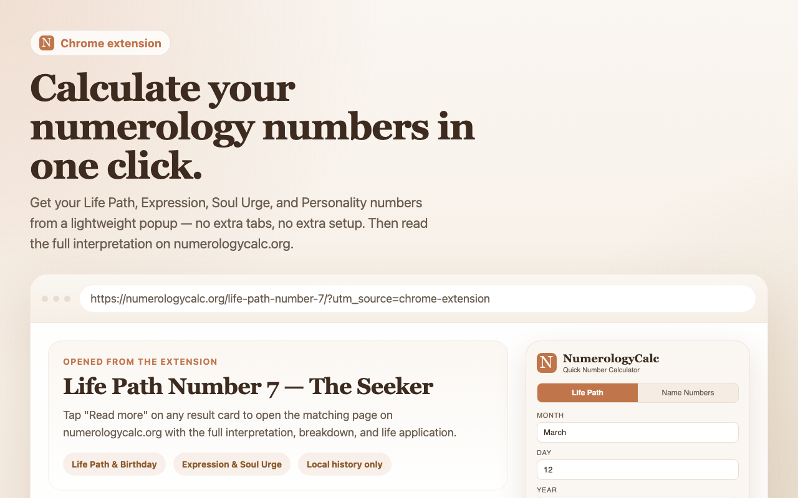

# NumerologyCalc — Chrome Extension

A lightweight Chrome extension for quick Pythagorean numerology calculations. Get your core numbers in seconds, right from the browser toolbar.

Built by the team behind **[numerologycalc.org](https://numerologycalc.org)** — a free, comprehensive numerology resource.



## Features

- **Life Path & Birthday Numbers** — enter your date of birth, get results instantly
- **Expression, Soul Urge & Personality Numbers** — calculated from your full birth name
- **Master Numbers preserved** — 11, 22, 33 are never reduced and highlighted with a distinct style
- **"Treat Y as vowel" toggle** — compare both Pythagorean interpretations
- **Recent calculations** — saved locally for quick revisits
- **Works offline** — core calculations need no internet
- **Keyboard shortcut** — `Ctrl+Shift+N` (Mac: `Ctrl+Shift+N`)
- **Minimal permissions** — only `storage`, zero data collection

## Install

### From Chrome Web Store

> Coming soon — link will be added here once published.

### From Source (Developer Mode)

1. Clone this repository:
   ```bash
   git clone https://github.com/Takea-nap/numerologycalc-chrome-extension.git
   ```
2. Open `chrome://extensions/` in Chrome
3. Enable **Developer mode** (top right)
4. Click **Load unpacked** and select the cloned folder
5. The NumerologyCalc icon appears in your toolbar — click it to start

## How It Works

1. Click the extension icon (or press `Ctrl+Shift+N`)
2. Choose **Life Path** tab and enter your date of birth — or **Name Numbers** tab and type your full birth name
3. Tap **Calculate** and see your results
4. Want the full interpretation? Click **"Read more"** to open the detailed page on [numerologycalc.org](https://numerologycalc.org)

## Project Structure

```
├── manifest.json        # Chrome extension manifest (MV3)
├── popup.html           # Extension popup UI
├── popup.css            # Styles
├── popup.js             # UI logic and event handling
├── lib/
│   ├── numerology.js    # Core calculation engine (Pythagorean method)
│   └── meanings.js      # Short descriptions for each number
├── icons/               # Extension icons (16/32/48/128px)
├── scripts/
│   ├── generate-icons.py    # Icon generation from source SVG
│   └── package-release.mjs  # Packaging script for Chrome Web Store
└── store-assets/        # Chrome Web Store listing assets
```

## Privacy

- **No data collection** — nothing is sent to any server, ever
- **No tracking, no analytics, no cookies**
- Only one permission: `storage` (saves recent calculations locally in your browser)
- "Read more" links open [numerologycalc.org](https://numerologycalc.org) in a new tab only when you choose to click them

## Packaging

To build a release zip for the Chrome Web Store:

```bash
node scripts/package-release.mjs
```

The output zip is saved to `dist/`.

## Learn More

- [numerologycalc.org](https://numerologycalc.org) — full numerology calculator with detailed interpretations
- [Life Path Number Calculator](https://numerologycalc.org/life-path-number-calculator/) — calculate and understand your Life Path Number
- [Expression Number Calculator](https://numerologycalc.org/expression-number-calculator/) — discover your natural strengths through your name

## License

MIT
